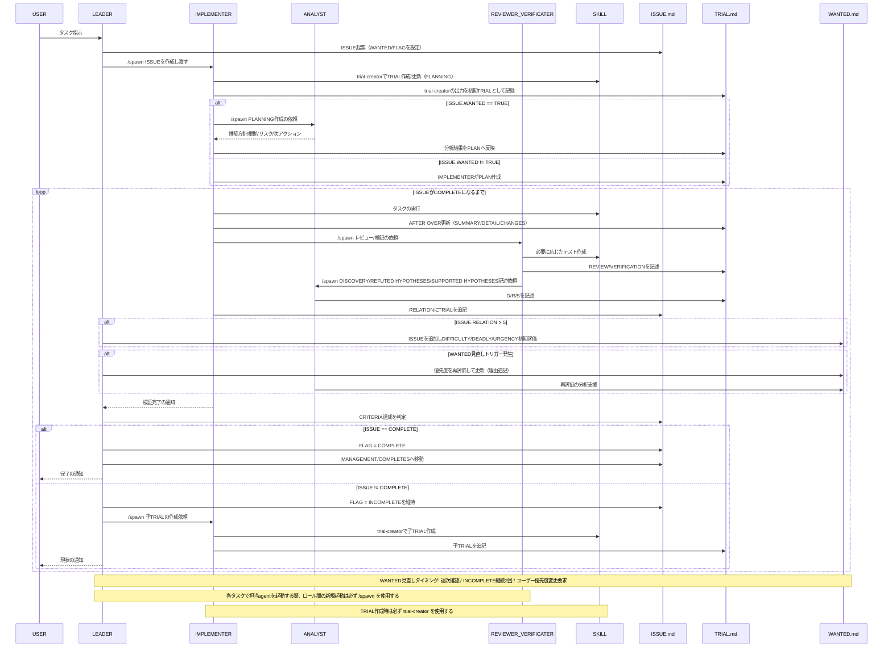

# WORKFLOW

```mermaid
sequenceDiagram
    participant USER
    participant LEADER
    participant IMPLEMENTER
    participant ANALYST
    participant REVIEWER_VERIFICATER
    participant SKILL
    participant ISSUE_DOC as ISSUE.md
    participant TRIAL_DOC as TRIAL.md
    participant WANTED_DOC as WANTED.md

    USER ->> LEADER : タスク指示
    LEADER ->> ISSUE_DOC : ISSUE起票（WANTED/FLAGを設定）
    LEADER ->> IMPLEMENTER : /spawn ISSUEを作成し渡す

    IMPLEMENTER ->> SKILL : trial-creatorでTRIAL作成/更新（PLANNING）
    IMPLEMENTER ->> TRIAL_DOC : trial-creatorの出力を初期TRIALとして記録
    alt ISSUE.WANTED == TRUE
        IMPLEMENTER ->> ANALYST : /spawn PLANNING作成の依頼
        ANALYST -->> IMPLEMENTER : 推奨方針/根拠/リスク/次アクション
        IMPLEMENTER ->> TRIAL_DOC : 分析結果をPLANへ反映
    else ISSUE.WANTED != TRUE
        IMPLEMENTER ->> TRIAL_DOC : IMPLEMENTERがPLAN作成
    end

    loop ISSUEがCOMPLETEになるまで
        IMPLEMENTER ->> SKILL : タスクの実行
        IMPLEMENTER ->> TRIAL_DOC : AFTER OVER更新（SUMMARY/DETAIL/CHANGES）

        IMPLEMENTER ->> REVIEWER_VERIFICATER : /spawn レビュー/検証の依頼
        REVIEWER_VERIFICATER ->> SKILL : 必要に応じたテスト作成
        REVIEWER_VERIFICATER ->> TRIAL_DOC : REVIEW/VERIFICATIONを記述
        REVIEWER_VERIFICATER ->> ANALYST : /spawn DISCOVERY/REFUTED HYPOTHESES/SUPPORTED HYPOTHESES記述依頼
        ANALYST ->> TRIAL_DOC : D/R/Sを記述

        IMPLEMENTER ->> ISSUE_DOC : RELATIONにTRIALを追記
        alt ISSUE.RELATION > 5
            LEADER ->> WANTED_DOC : ISSUEを追加しDIFFICULTY/DEADLY/URGENCY初期評価
        end

        alt WANTED見直しトリガー発生
            LEADER ->> WANTED_DOC : 優先度を再評価して更新（理由追記）
            ANALYST ->> WANTED_DOC : 再評価の分析支援
        end

        IMPLEMENTER -->> LEADER : 検証完了の通知
        LEADER ->> ISSUE_DOC : CRITERIA達成を判定

        alt ISSUE == COMPLETE
            LEADER ->> ISSUE_DOC : FLAG = COMPLETE
            LEADER ->> ISSUE_DOC : MANAGEMENT/COMPLETESへ移動
            LEADER -->> USER : 完了の通知
        else ISSUE != COMPLETE
            LEADER ->> ISSUE_DOC : FLAG = INCOMPLETEを維持
            LEADER ->> IMPLEMENTER : /spawn 子TRIALの作成依頼
            IMPLEMENTER ->> SKILL : trial-creatorで子TRIAL作成
            IMPLEMENTER ->> TRIAL_DOC : 子TRIALを追記
            LEADER -->> USER : 現状の通知
        end
    end

    Note over LEADER,WANTED_DOC: WANTED見直しタイミング: 週次確認 / INCOMPLETE継続2回 / ユーザー優先度変更要求
    Note over LEADER,REVIEWER_VERIFICATER: 各タスクで担当agentを起動する際、ロール間の新規起動は必ず /spawn を使用する
    Note over IMPLEMENTER,SKILL: TRIAL作成時は必ず trial-creator を使用する
```
