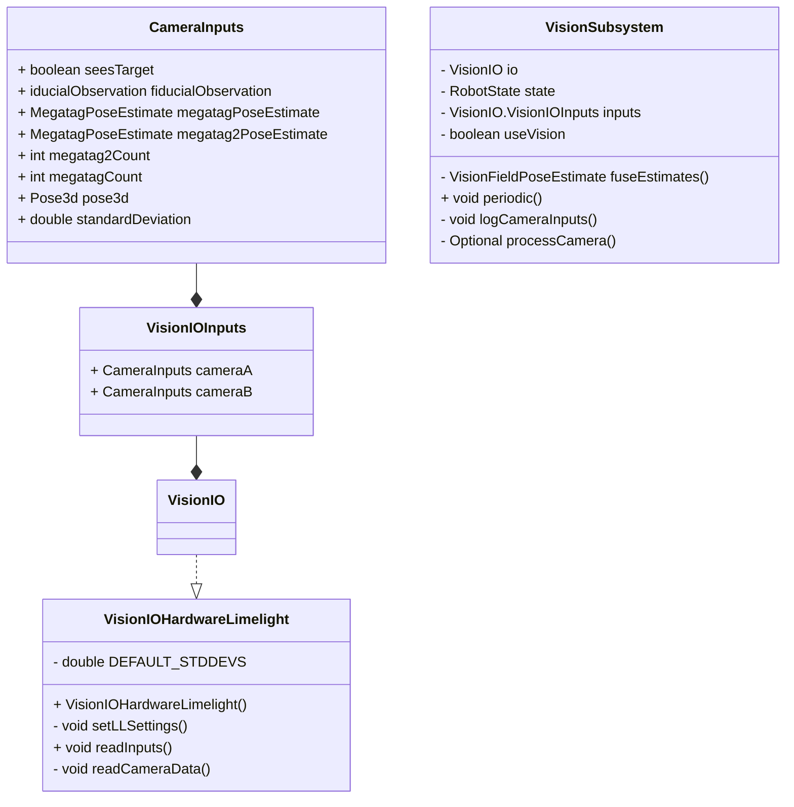

```mermaid
classDiagram
class CameraInputs {
    + boolean seesTarget
    + iducialObservation fiducialObservation
    + MegatagPoseEstimate megatagPoseEstimate
    + MegatagPoseEstimate megatag2PoseEstimate
    + int megatag2Count
    + int megatagCount
    + Pose3d pose3d
    + double standardDeviation
}
class VisionIOInputs {
    + CameraInputs cameraA
    + CameraInputs cameraB
}
class VisionIO {}
class VisionIOHardwareLimelight {
    - double DEFAULT_STDDEVS
    + VisionIOHardwareLimelight()
    - void setLLSettings()
    + void readInputs()
    - void readCameraData()
}

class VisionSubsystem {
    - VisionIO io
    - RobotState state
    - VisionIO.VisionIOInputs inputs
    - boolean useVision

    - VisionFieldPoseEstimate fuseEstimates()
    + void periodic()
    - void logCameraInputs()
    - Optional processCamera()
}
CameraInputs --* VisionIOInputs
VisionIOInputs --* VisionIO
VisionIO ..|> VisionIOHardwareLimelight
```